# ¡Hola! 👋 Soy Arturo

  

## Sobre mí  
Desarrollador de 18 años especializado en aplicaciones web y Android, con enfoque en Kotlin y Jetpack Compose. Comprometido con el código abierto y la innovación tecnológica.

## Stack Tecnológico

```mermaid
mindmap
  root((Tecnologías))
    Frontend
      JavaScript
      TypeScript
      React
      HTML5
      CSS3
    Backend
      Python
      C#
    Mobile
      Kotlin
      Jetpack Compose
    Herramientas
      Git
      VS Code
      Android Studio
```

## Métricas de GitHub

  
  

## Reconocimientos

## Actividad de Contribución

  

## Formación y Certificaciones

### Desarrollo Web y Programación (FreeCodeCamp)
- Desarrollo Web Responsivo
- Algoritmos y Estructuras de Datos en JavaScript
- Desarrollo Frontend

### Infraestructura y Sistemas (Ademass - Campus)
- Fundamentos de Linux
- HTML5 & CSS3 Avanzado

<strong>Ver Certificados</strong>

 

#### FreeCodeCamp

  
  
  
  

#### Ademass - Campus

  
  
  

## Actividad de Contribución

## Información de Contacto

| Método | Contacto |
|--------|----------|
| Email  | [cervantesarturo254@gmail.com](mailto:cervantesarturo254@gmail.com) |
| GitHub | [Arturo254](https://github.com/Arturo254) |

---

  

